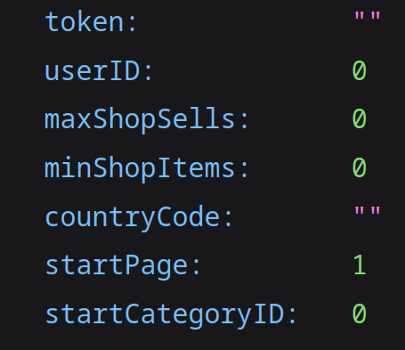

# ⭐ ETSY PARSER


**Подсказка:** Для любого нашего продукта требуется установить [_Java 17_](https://github.com/adoptium/temurin17-binaries/releases/download/jdk-17.0.10%2B7/OpenJDK17U-jdk\_x64\_windows\_hotspot\_17.0.10\_7.msi)


## Установка

После покупки подписки на продукт вам необходимо зайти в раздел <mark style="color:red;">Подписки</mark>, выбрать <mark style="color:red;">Darkness</mark> и нажать на кнопку <mark style="color:red;">Скачать</mark>

После нажатия данной кнопки подождите несколько секунд, пока бот сформирует архив с парсером и отправит его вам


**Предупреждение**: В отдельных случаях бот может отправлять файл с парсером до минуты.


> После всех манипуляций мы получаем архив с расширением .rar, который необходимо разархивировать в директорию, в которой нет русских символов.
>
> **Пример**: _/home/user/work/parser_

## Настройки

Перед тем как начать использовать парсер его необходимо настроить.

Открываем файл **settings.json**

<figure><figcaption>
Стандартный файл конфигурации
</figcaption></figure>

> _<mark style="color:purple;">token</mark>_ - Токен вашего бота, его можно создать в [_BotFather_](https://t.me/BotFather)
>
> _<mark style="color:purple;">userID</mark>_ - Ваш Telegram ID, получить его можно в главном меню бота
>
> _<mark style="color:purple;">maxShopSells</mark>_ - Максимальное количество продаж у магазина
>
> _<mark style="color:purple;">minShopItems</mark>_ - Минимальное количество товаров у магазина
>
> _<mark style="color:purple;">countryCode</mark>_ - Код страны для парсинга. Узнать его можно в парсере, написав команду <mark style="color:yellow;">/ct</mark>
>
> _<mark style="color:purple;">startPage</mark>_ - Страница, с которой нужно начать поиск. <mark style="color:red;">Не рекомендуется изменять</mark>
>
> _<mark style="color:purple;">startCategoryID</mark>_ - Категория, с которой нужно начать поиск. <mark style="color:red;">Не рекомендуется изменять</mark>

## Использование

После всех проделанных действий остается только запустить файл start.bat.

Как только у вас пройдет авторизация, у вас будет 10 секунд чтобы включить VPN, иначе вы не сможете подключиться к сайту etsy из-за  санкций.


Внимание: Обязательно запускаем VPN после авторизации! В противном случае авторизация не пройдет и вы получите бан на авторизацию в парсере на 10 минут. В случае получения такого бана время подписки мы не возвращаем


Вы будете получать уведомления в Telegram от вашего бота, а так же продавцы будут сохраняться в папку output/sellers-дата.csv

Вот и все. При возникновении любых ошибок и проблем обращайтесь в [Darkness Manager](https://t.me/darknessmanager)

***

> Данный мануал последний раз был отредактирован в 15:11 | 09.03.2024
>
> Отредактировал: [outcreated](https://t.me/neverlessy) (Программист)
